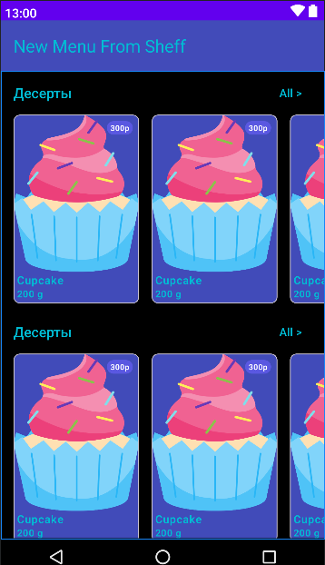

# Электронное меню для ресторанов

Описание -- "Посетитель ресторана сканирует qr код находящийся на столе и попадает на страницу с акутальным меню
Владельцы ресторана могут в любой момент менять позиции в меню, доступность в данный момент и другие свойства"

New Menu From Sheff (электронное меню в ресторане) – это интерактивный сервис, который позволяет посетителям ознакомиться 
со списком блюд и легко выбрать понравившееся. При этом совершенно необязательно подзывать официанта.

## Визуальная схема фронтенда

## Документация

1. Маркетинг
   1. [Заинтересанты](./docs/01-marketing/01-stakeholders.md)
   2. [Целевая аудитория](./docs/01-marketing/02-target-audience.md)
   3. [Конкурентный анализ](./docs/01-marketing/03-concurrency.md)
   4. [Анализ экономики](./docs/01-marketing/04-economy.md)
   5. [Пользовательские истории](./docs/01-marketing/05-user-stories.md)
2. DevOps
   1. [Схема инфраструктуры](./docs/02-devops/01-infrastruture.md)
   2. [Схема мониторинга](./docs/02-devops/02-monitoring.md)
3. Тесты
4. Архитектура

